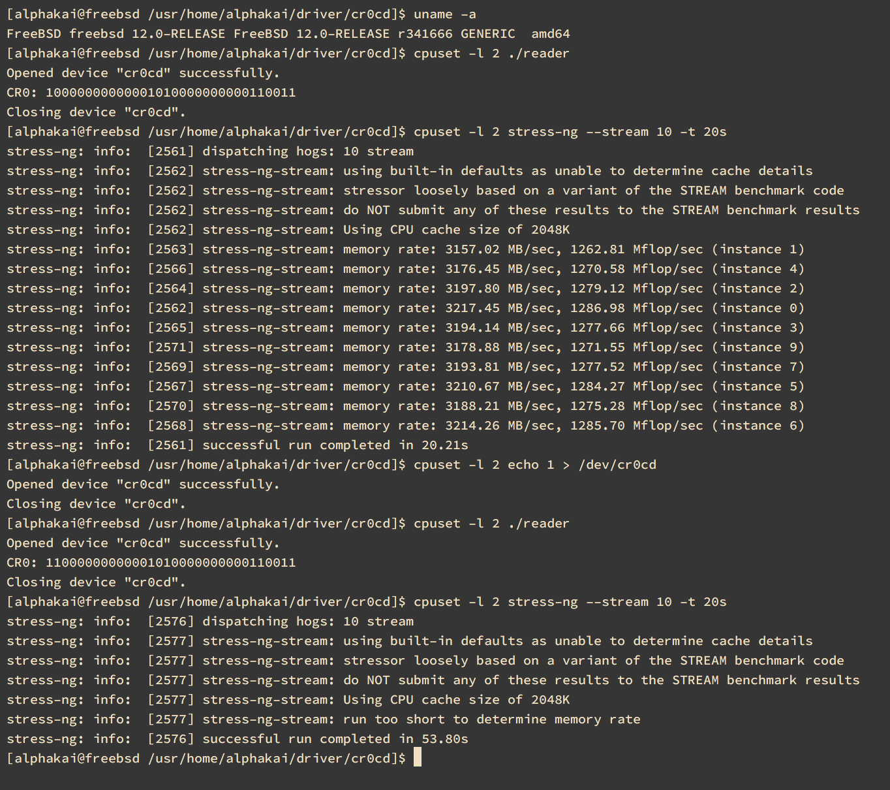

# cr0cd_fbsd
CR0.CD manipulate FreeBSD Kernel Module as a character device.  
This is a FreeBSD version of [cr0cd](https://github.com/alphaKAI/cr0cd)  

## Installation
```sh
$ git clone https://github.com/alphaKAI/cr0cd_fbsd
$ cd cr0cd_fbsd
$ make
$ gcc -o reader reader.c
```

## Usage

CR0 exists on each of CPU core, you need specify which core will be disabled by taskset.

```
$ sudo kldload -v ./cr0cd.ko
$ taskset -c $CORE_NUMBER echo 1 > /dev/cr0cd # Disable CPU Cache
$ taskset -c $CORE_NUMBER some command # run on CPU Cache is disabled
$ taskset -c $CORE_NUMBER echo 0 > /dev/cr0cd # Enable CPU Cache
$ taskset -c $CORE_NUMBER ./reader # display current CR0 bits
```

## Screenshot

This is an example of how CPU Cache disable affects.  



Memory access speed down to 3GB/sec -> unmeasurable(too slow).  

## LICENSE
cr0cd is released under the MIT License.  
Please see `LICENSE` for more details.  
Copyright (C) 2019 Akihiro Shoji.